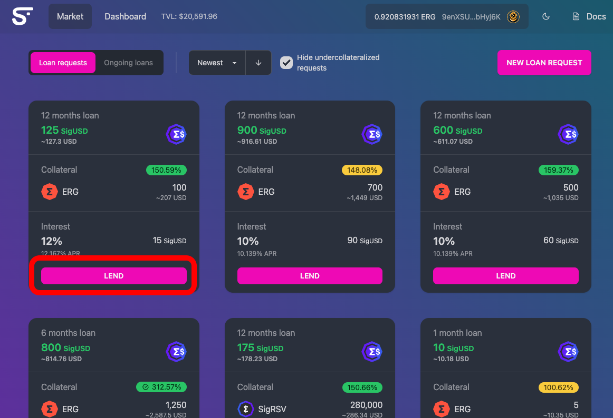

# Fulfilling a Loan Request

1. With your wallet connected, click on "LEND"

<figure><figcaption></figcaption></figure>

2. Verify that the terms and parameters of the loan feel safe and reasonable to you. You will not have access to the lent assets for the entire loan term, and the borrower may fail to repay the loan - verify that the collateral has actual value and you would feel comfortable receiving that collateral in the event that the loan is not repaid

<figure><figcaption></figcaption></figure>

3. Click "CONFIRM" and then in the Nautilus pop-up window, sign the transaction

<figure><figcaption></figcaption></figure>

This will send your loaned assets, ERG for transaction fee, and ERG for the service fee.

4. Wait for transaction confirmation - That's it! Your loan request will then appear in the dashboard section of the SigmaFi UI.
5. Monitor the loan and at time of repayment, if the borrow has not repaid the loan you can choose to liquidate the collateral that was put up at time of loan request. Liquidations are not done automatically, so you will need to check on your loan periodically.
