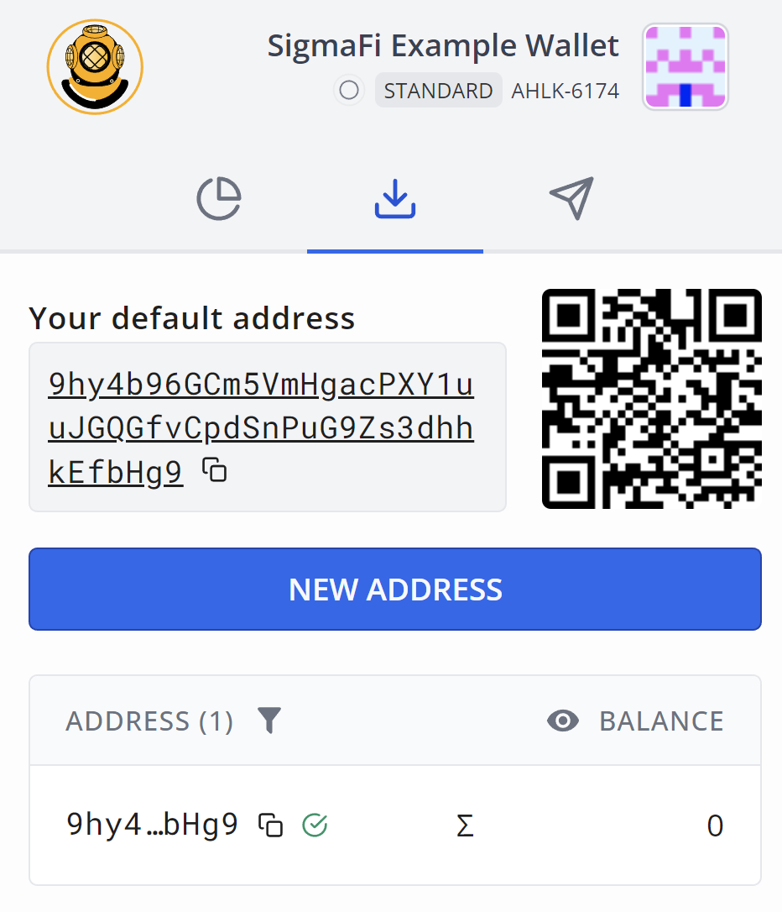
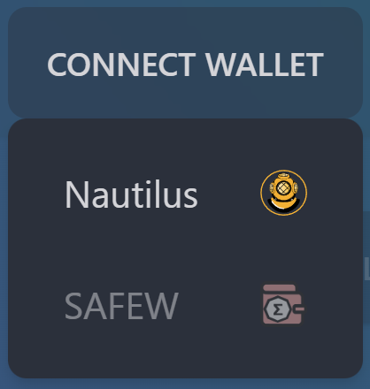
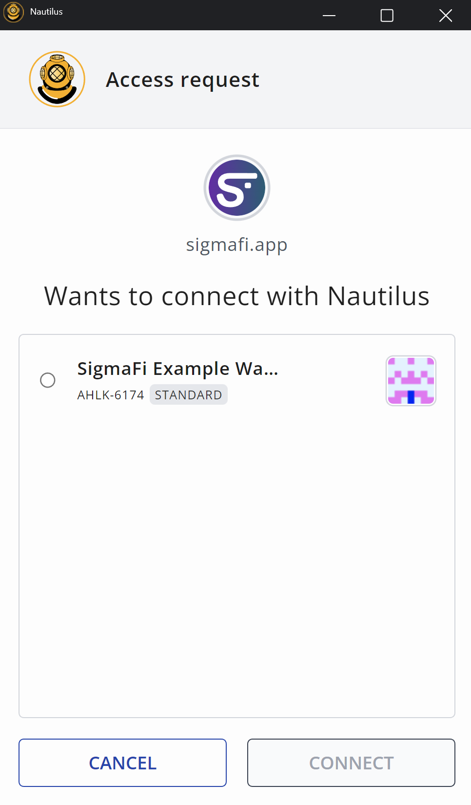

# Nautilus Quick-Start

### 1. Install wallet[​](https://docs.spectrum.fi/docs/user-guides/quick-start#1-install-wallet) 

1.1. First you need to install the Nautilus wallet. You will need to disable any other Ergo wallet extensions such as SAFEW. Then clear browser cache and refresh page.

1.2. To install Nautilus visit the following link in Google Store:

* [Nautilus](https://chrome.google.com/webstore/detail/nautilus/gjlmehlldlphhljhpnlddaodbjjcchai): a browser extension wallet app

1.3. Access Nautilus by clicking on the puzzle piece in your browser.

<figure><figcaption></figcaption></figure>

### 2. Create a wallet[​](https://docs.spectrum.fi/docs/user-guides/quick-start#2-create-a-wallet) 

2.1. Click on Nautilus extension to open wallet.

2.1. Accept KYA.

2.2. Click on "Create Wallet" button:

<figure><figcaption></figcaption></figure>

2.3. Type wallet name (of your choice) and wallet spending password:

<figure><figcaption></figcaption></figure>

2.4. Record a recovery phrase in a safe place! This phrase is the only way to restore your wallet!

2.5. Once confirmed, you will see the screen like following. That means that you've successfully created your wallet. Congrats!

<figure><figcaption></figcaption></figure>

### 3. Get assets[​](https://docs.spectrum.fi/docs/user-guides/quick-start#3-get-assets) 

To get some assets to swap or to provide liquidity first you will need to transfer them to the Nautilus address:

<figure><figcaption></figcaption></figure>

#### 3.1. Get real assets[​](https://docs.spectrum.fi/docs/user-guides/quick-start#31-get-real-assets) 

Get some ERG on one of the following exchanges ([list of available exchanges](https://ergoplatform.org/en/exchanges/)) and withdraw them to your Nautilus wallet address.

#### 3.2. Get test assets[​](https://docs.spectrum.fi/docs/user-guides/quick-start#32-get-test-assets) 

Just visit [Ergo Faucet](https://ergofaucet.org/) and follow suggested steps.

### 4. Connect wallet to SigmaFi[​](https://docs.spectrum.fi/docs/user-guides/quick-start#4-connect-wallet-to-spectrum-finance) 

4.1. Go to [https://sigmafi.app/#/](https://sigmafi.app/#/)

4.2. Click connect wallet button

<figure><figcaption></figcaption></figure>

4.3. Select the Nautilus wallet you would like to use, Nautilus in this case.

<figure><figcaption></figcaption></figure>

<figure><figcaption></figcaption></figure>

4.4. Congrats! Now you are ready to start use SigmaFi! Your ERG balance will appear here!

<figure><figcaption></figcaption></figure>
